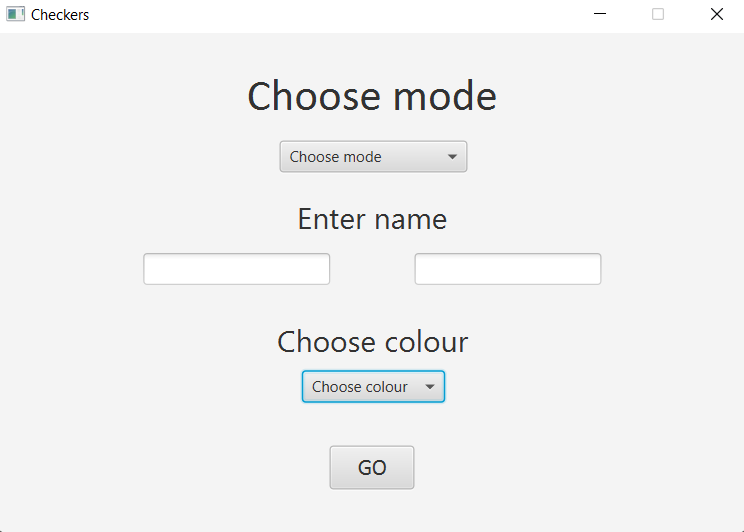
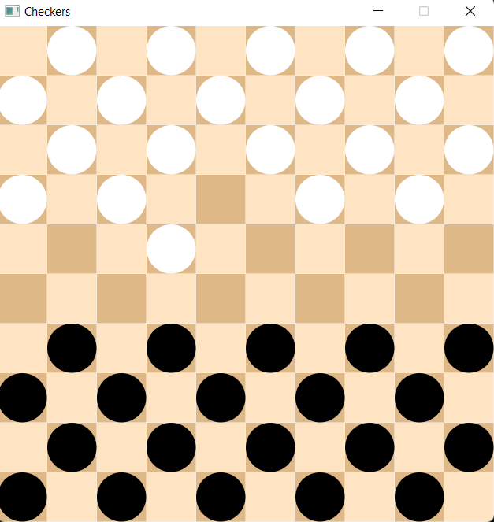
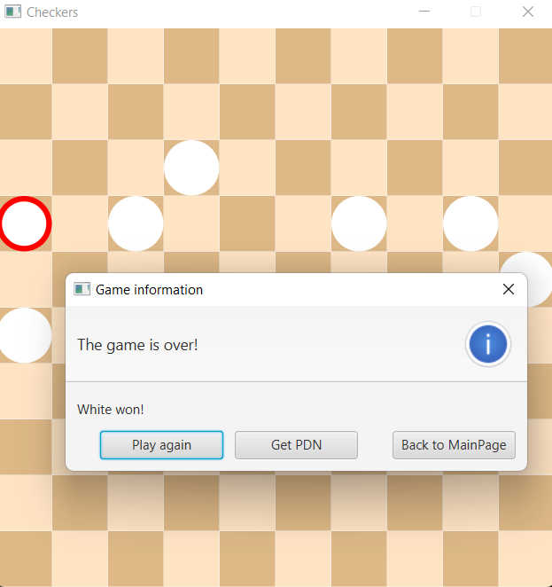

# Checkers Game with AI in JavaFX

Fully functional checkers game developed using JavaFX for the GUI and Maven as a project management tool.

## Game Modes

Application allows you to play with another player in a hotseat mode, play with an AI or watch a game 
between two AI players. AI is based on Minimax algorithm with Alfa-Beta pruning with maximum depth 7
due to performance issues.

## Development

One of the goals of this project is to implement the game of checkers following OOP rules. Because of that
pieces and board are implemented as different objects, which makes the application suboptimal in terms of
time and memory complexity.

The project is still under development and will be expanded in the future (another checkers modes and
possibly even another board games). 

## Installation

1. Clone the repository and go to the project directory:
   ```bash
   git clone https://github.com/yourusername/checkers-javafx.git
   cd Checkers
   ```
2. Compile the application:
   ```bash
   mvn clean install
   ```
3. Run the application:
   ```bash
   mvn javafx:run
   ```

## GUI

### Main Menu

After running the application main menu is shown, where you can
choose mode, enter players' names and choose colour.



### Game



### End of the game

After the game ends you can play again the same mode, go back to main manu or
download the [PDN][1]  of the game.



## To-Do

- implement SOLID and dependency injection principles
- add more tests
- add another checkers modes
- add another board games (especially chess)

[1]: https://en.wikipedia.org/wiki/Portable_Draughts_Notation